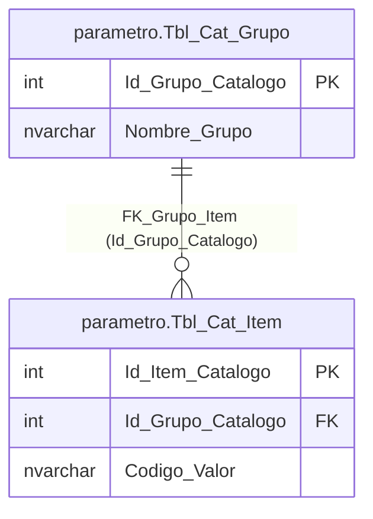
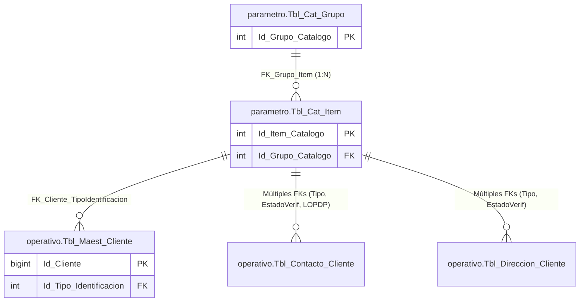

📋 Estructura de Encabezados por Objeto (Templates Markdown)
Para Tablas:
*Descripción General*: Propósito del objeto en el negocio.

Estructura de Columnas: Tabla con Campo, Tipo de Dato, Nulidad, Clave (PK/FK), Default y Descripción/Regla de Negocio.

Índices y Restricciones (Constraints): Claves primarias, foráneas e índices de performance (CLUSTERED / NONCLUSTERED).

Para Vistas:
Descripción General: Qué datos consolida y cuál es su objetivo de consulta.

Columnas Proyectadas: Origen detallado de los campos expuestos.

A continuación, tienes el Inventario de Objetos detectados en el script, clasificados por su respectivo esquema lógico para que puedas ir pidiéndomelos uno por uno:

🗂️ Lista de Objetos Detectados (DB_ODS)
1. Esquema: parametro (Catálogos y Parametría Global)
[ ] Tabla: parametro.Tbl_Cat_Grupo — Grupos o categorías de catálogos.

[ ] Tabla: parametro.Tbl_Cat_Item — Ítems o valores pertenecientes a cada grupo.

[ ] Vista: parametro.Vw_Cat_Detalle_General — Vista indexada/vinculada de catálogos e ítems.

2. Esquema: operativo (Capa de Negocio y Core de Clientes)
[ ] Tabla: operativo.Tbl_Maest_Cliente — Maestro principal de información del cliente.

[ ] Tabla: operativo.Tbl_Contacto_Cliente — Detalle de medios de contacto (Teléfonos, Correos).

[ ] Tabla: operativo.Tbl_Direccion_Cliente — Datos geográficos y domiciliarios detallados.

[ ] Tabla: operativo.Tbl_Financiero_cliente — Segmentación contable y montos financieros.

[ ] Tabla: operativo.Tbl_Oficializacion_Core — Historial de auditoría de envío de tramas JSON al Core.

[ ] Vista: operativo.vw_Contactabilidad_Clientes — Filtro rápido de clientes con tipo de contacto celular.

[ ] Vista: operativo.vw_Clientes_Contactos_Detalle — Consolidado horizontal (Pivot) de datos del perfil de cliente.

3. Esquema: seguridad (Autenticación y Control de Accesos)
[ ] Tabla: seguridad.Tbl_Maest_Usuario — Maestro de usuarios/asesores del sistema.

## 📖 Tabla: `parametro.Tbl_Cat_Grupo`
**Base de Datos:** `DB_ODS`  
**Esquema:** `parametro`  
**Objeto:** `Tbl_Cat_Grupo`  
**Fecha de Generación:** 02/06/2026

### 1. Descripción General
Esta tabla actúa como el **Aggregate Root** (Raíz del Agregado) para el sistema de parametrización y catálogos globales de la aplicación. Su propósito principal es agrupar lógicamente diferentes colecciones de ítems o constantes (ej: Tipos de Identificación, Estados de Verificación, Roles del Sistema, etc.). Define si el grupo es crítico para el funcionamiento del código (`Es_Sistema`) y mantiene la trazabilidad de auditoría elemental.

---

### 2. Estructura de Columnas

| Campo | Tipo de Dato | Nulidad | Clave | Default | Descripción / Regla de Negocio |
| :--- | :--- | :--- | :---: | :---: | :--- |
| **Id_Grupo_Catalogo** | `int` | `NOT NULL` | **PK** | *Identity(1,1)* | Identificador único y secuencial auto-incrementable de la categoría del catálogo. |
| **Nombre_Grupo** | `nvarchar(100)` | `NOT NULL` | | | Nombre único que identifica al grupo. Se utiliza directamente en el código de la aplicación (C# Enums) para mapear constantes de negocio. |
| **Descripcion** | `nvarchar(250)` | `NULL` | | | Explicación funcional detallada sobre el uso, propósito y alcance de este grupo de catálogos. |
| **Es_Sistema** | `bit` | `NOT NULL` | | `CONVERT(bit, 0)` | Indica si el grupo es nativo del núcleo del software. Si es `1 (True)`, significa que el código depende críticamente de él y no debería ser modificado manualmente en producción. |
| **Fecha_Creacion** | `datetime2(3)` | `NOT NULL` | | `getdate()` | Marca de tiempo precisa de cuándo se insertó el registro en la base de datos (precisión de 3 decimales). |
| **Usuario_Creacion** | `nvarchar(50)` | `NULL` | | | Nombre de usuario o identificador del sistema/proceso que registró la categoría por primera vez. |
| **Fecha_Modificacion** | `datetime2(3)` | `NULL` | | | Marca de tiempo precisa de la última actualización aplicada sobre este registro. |
| **Usuario_Modificacion**| `nvarchar(50)` | `NULL` | | | Nombre de usuario o proceso que realizó la última alteración de los datos. |

---

### 3. Índices y Restricciones (Constraints)

#### Clave Primaria (Primary Key)
* **`PK_Tbl_Cat_Grupo`**: Clave primaria de tipo `CLUSTERED`. Define que el orden físico de almacenamiento de los registros en el disco duro de SQL Server se rige por la columna **`Id_Grupo_Catalogo`** de manera ascendente (`ASC`).

#### Índices de Rendimiento y Unicidad
* **`UQ_GrupoCatalogo_NombreGrupo`**: Índice de tipo `UNIQUE NONCLUSTERED` aplicado sobre la columna **`Nombre_Grupo`**. 
  * *Regla de Negocio:* Garantiza a nivel de motor de base de datos que no existan dos agrupaciones con el mismo nombre, protegiendo la integridad del mapeo de constantes del software y optimizando las búsquedas directas por texto.

---

### 4. Relaciones (Diagrama de Dependencias)
* **Tablas Dependientes (Hijas):**
  * `parametro.Tbl_Cat_Item` vía FK `FK_Grupo_Item` (`Id_Grupo_Catalogo` -> `Id_Grupo_Catalogo`). Relación de uno a muchos (1:N), donde un grupo puede contener múltiples ítems.

---

## 📖 Tabla: `parametro.Tbl_Cat_Item`
**Base de Datos:** `DB_ODS`  
**Esquema:** `parametro`  
**Objeto:** `Tbl_Cat_Item`  
**Fecha de Generación:** 02/06/2026

### 1. Descripción General
Esta tabla almacena los ítems, opciones o valores específicos que pertenecen a cada categoría o grupo de catálogo (`Tbl_Cat_Grupo`). Funciona como el detalle en una relación maestro-detalle. Su propósito es proveer las opciones dinámicas que alimentarán las listas desplegables (dropdowns), componentes de interfaz de usuario y códigos internos de validación lógica del software (ej: "ADMIN", "CEDULA", "VERIFICADO").

---

### 2. Estructura de Columnas

| Campo | Tipo de Dato | Nulidad | Clave | Default | Descripción / Regla de Negocio |
| :--- | :--- | :--- | :---: | :---: | :--- |
| **Id_Item_Catalogo** | `int` | `NOT NULL` | **PK** | | Identificador único global de cada ítem de catálogo. Es utilizado por las tablas de negocio como Clave Foránea (FK) para apuntar de manera fija a un estado o parámetro. |
| **Id_Grupo_Catalogo** | `int` | `NOT NULL` | **FK** | | Código del grupo al que pertenece el ítem. Vincula este registro directamente con su padre en `parametro.Tbl_Cat_Grupo`. |
| **Codigo_Valor** | `nvarchar(20)` | `NOT NULL` | | | Código alfanumérico corto inteligible por los desarrolladores y el sistema (ej: "CED", "RUC", "PAS"). Es inmutable a nivel de lógica de aplicación. |
| **Texto_Visual** | `nvarchar(100)` | `NOT NULL` | | | Texto descriptivo o etiqueta en lenguaje natural que se renderiza en la interfaz de usuario para el usuario final (ej: "Cédula de Identidad"). |
| **Orden_Visual** | `int` | `NOT NULL` | | | Valor numérico entero que dicta la secuencia posicional del ítem al listarse o cargarse en componentes de interfaz (Combobox/Select). |
| **Esta_Activo** | `bit` | `NOT NULL` | | `CONVERT(bit, 1)` | Flag de borrado lógico / disponibilidad. Si es `1 (True)`, el ítem está disponible. Si es `0 (False)`, el software no lo cargará en nuevos registros pero preserva la integridad de los datos históricos. |
| **Fecha_Creacion** | `datetime2(3)` | `NOT NULL` | | `getdate()` | Marca de tiempo precisa de cuándo se registró este ítem (precisión de 3 decimales). |
| **Usuario_Creacion** | `nvarchar(50)` | `NULL` | | | Cuenta o proceso de auditoría que insertó el ítem por primera vez. |
| **Fecha_Modificacion** | `datetime2(3)` | `NULL` | | | Marca de tiempo precisa de la última alteración de configuración de este ítem. |
| **Usuario_Modificacion**| `nvarchar(50)` | `NULL` | | | Identificador del usuario o proceso que realizó la última actualización. |

---

### 3. Índices y Restricciones (Constraints)

#### Clave Primaria (Primary Key)
* **`PK_Tbl_Cat_Item`**: Clave primaria de tipo `CLUSTERED` sobre la columna **`Id_Item_Catalogo`**. Determina el ordenamiento y estructuración física de almacenamiento secuencial en las páginas de datos del disco duro.

#### Claves Foráneas (Foreign Keys)
* **`FK_Grupo_Item`**: Restricción de integridad referencial aplicada a la columna **`Id_Grupo_Catalogo`**. Asegura de forma estricta que no se pueda registrar un ítem bajo un grupo inexistente en `parametro.Tbl_Cat_Grupo`.

#### Índices de Rendimiento y Unicidad
* **`UQ_ItemCatalogo_IdGrupoCatalogo_CodigoValor`**: Índice de tipo `UNIQUE NONCLUSTERED` compuesto por las columnas **(`Id_Grupo_Catalogo`, `Codigo_Valor`)**.
  * *Regla de Negocio:* Impide de forma absoluta la duplicidad de códigos de valor dentro de una misma categoría (por ejemplo, prohíbe que el grupo "TiposIdentificacion" tenga dos ítems con el código "CED").
* **`IX_ItemCatalogo_Buscador`**: Índice compuesto `NONCLUSTERED` sobre **(`Id_Grupo_Catalogo`, `Esta_Activo`)** que incluye como columnas de cobertura (`INCLUDE`) a `Codigo_Valor`, `Texto_Visual` y `Orden_Visual`.
  * *Estrategia de Performance:* Optimiza sustancialmente las consultas del backend que filtran por grupos activos para llenar combos en la interfaz gráfica, evitando lecturas pesadas a la tabla.

---

### 4. Relaciones (Diagrama de Dependencias)

