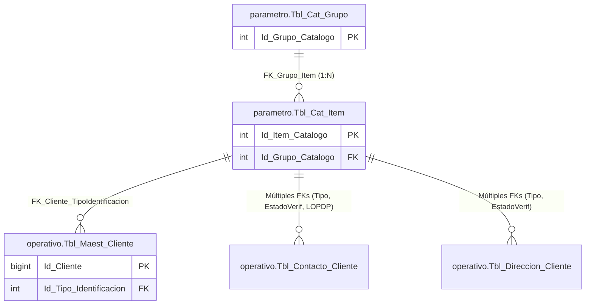

## 2. parametro.Tbl_Cat_Item (Diagrama de Dependencias)

```mermaid
erDiagram
    "parametro.Tbl_Cat_Grupo" ||--o{ "parametro.Tbl_Cat_Item" : "FK_Grupo_Item (1:N)"
    "parametro.Tbl_Cat_Item" ||--o{ "operativo.Tbl_Maest_Cliente" : "FK_Cliente_TipoIdentificacion"
    "parametro.Tbl_Cat_Item" ||--o{ "operativo.Tbl_Contacto_Cliente" : "Múltiples FKs (Tipo, EstadoVerif, LOPDP)"
    "parametro.Tbl_Cat_Item" ||--o{ "operativo.Tbl_Direccion_Cliente" : "Múltiples FKs (Tipo, EstadoVerif)"

    "parametro.Tbl_Cat_Grupo" {
        int Id_Grupo_Catalogo PK
    }
    "parametro.Tbl_Cat_Item" {
        int Id_Item_Catalogo PK
        int Id_Grupo_Catalogo FK
    }
    "operativo.Tbl_Maest_Cliente" {
        bigint Id_Cliente PK
        int Id_Tipo_Identificacion FK
    }
```
