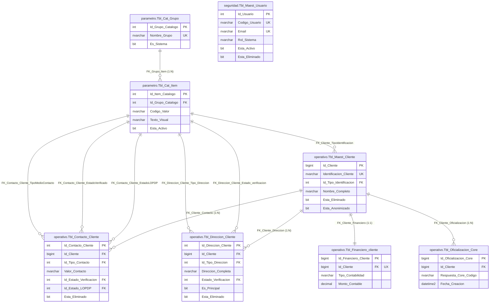

# Diagrama de Referencia de Entidad-Relación (ERD) para el DSH

```mermaid
erDiagram
    %% =======================================================
    %% ESQUEMA: parametro
    %% =======================================================
    "parametro.Tbl_Cat_Grupo" {
        int Id_Grupo_Catalogo PK
        nvarchar Nombre_Grupo UK
        bit Es_Sistema
    }

    "parametro.Tbl_Cat_Item" {
        int Id_Item_Catalogo PK
        int Id_Grupo_Catalogo FK
        nvarchar Codigo_Valor
        nvarchar Texto_Visual
        bit Esta_Activo
    }

    %% =======================================================
    %% ESQUEMA: operativo
    %% =======================================================
    "operativo.Tbl_Maest_Cliente" {
        bigint Id_Cliente PK
        nvarchar Identificacion_Cliente UK
        int Id_Tipo_Identificacion FK
        nvarchar Nombre_Completo
        bit Esta_Eliminado
        bit Esta_Anonimizado
    }

    "operativo.Tbl_Contacto_Cliente" {
        int Id_Contacto_Cliente PK
        bigint Id_Cliente FK
        int Id_Tipo_Contacto FK
        nvarchar Valor_Contacto
        int Id_Estado_Verificacion FK
        int Id_Estado_LOPDP FK
        bit Esta_Eliminado
    }

    "operativo.Tbl_Direccion_Cliente" {
        int Id_Direccion_Cliente PK
        bigint Id_Cliente FK
        int Id_Tipo_Direccion FK
        nvarchar Direccion_Completa
        int Estado_Verificacion FK
        bit Es_Principal
        bit Esta_Eliminado
    }

    "operativo.Tbl_Financiero_cliente" {
        bigint Id_Financiero_Cliente PK
        bigint Id_Cliente FK "UX"
        nvarchar Tipo_Contabilidad
        decimal Monto_Contable
    }

    "operativo.Tbl_Oficializacion_Core" {
        bigint Id_Oficializacion_Core PK
        bigint Id_Cliente FK
        nvarchar Respuesta_Core_Codigo
        datetime2 Fecha_Creacion
    }

    %% =======================================================
    %% ESQUEMA: seguridad
    %% =======================================================
    "seguridad.Tbl_Maest_Usuario" {
        int Id_Usuario PK
        nvarchar Codigo_Usuario UK
        nvarchar Email UK
        nvarchar Rol_Sistema
        bit Esta_Activo
        bit Esta_Eliminado
    }

    %% =======================================================
    %% RELACIONES / DEPENDENCIAS (CONSTRAINTS)
    %% =======================================================
    
    %% Relaciones Internas del Esquema Parametros
    "parametro.Tbl_Cat_Grupo" ||--o{ "parametro.Tbl_Cat_Item" : "FK_Grupo_Item (1:N)"

    %% Relaciones desde Parametros hacia el Core Operativo
    "parametro.Tbl_Cat_Item" ||--o{ "operativo.Tbl_Maest_Cliente" : "FK_Cliente_TipoIdentificacion"
    "parametro.Tbl_Cat_Item" ||--o{ "operativo.Tbl_Contacto_Cliente" : "FK_Contacto_Cliente_TipoMedioContacto"
    "parametro.Tbl_Cat_Item" ||--o{ "operativo.Tbl_Contacto_Cliente" : "FK_Contacto_Cliente_EstadoVerificado"
    "parametro.Tbl_Cat_Item" ||--o{ "operativo.Tbl_Contacto_Cliente" : "FK_Contacto_Cliente_EstadoLOPDP"
    "parametro.Tbl_Cat_Item" ||--o{ "operativo.Tbl_Direccion_Cliente" : "FK_Direccion_Cliente_Tipo_Direccion"
    "parametro.Tbl_Cat_Item" ||--o{ "operativo.Tbl_Direccion_Cliente" : "FK_Direccion_Cliente_Estado_verificacion"

    %% Relaciones del Core Operativo (Maestro-Detalles del Cliente)
    "operativo.Tbl_Maest_Cliente" ||--o{ "operativo.Tbl_Contacto_Cliente" : "FK_Cliente_Contacto (1:N)"
    "operativo.Tbl_Maest_Cliente" ||--o{ "operativo.Tbl_Direccion_Cliente" : "FK_Cliente_Direccion (1:N)"
    "operativo.Tbl_Maest_Cliente" ||--|| "operativo.Tbl_Financiero_cliente" : "FK_Cliente_Financiero (1:1)"
    "operativo.Tbl_Maest_Cliente" ||--o{ "operativo.Tbl_Oficializacion_Core" : "FK_Cliente_Oficializacion (1:N)"
```
