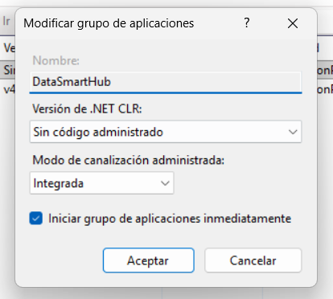
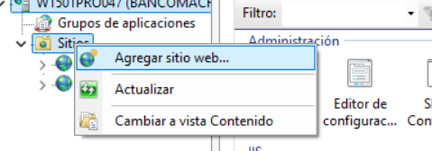

# Manual de Implementación — Data Smart Hub

**Sistema:** Contactabilidad Inteligente  
**Plataforma:** ASP.NET Core 10 sobre IIS  
**Revisión:** 2026-05-27

---

## Tabla de Contenidos

1. [Requisitos previos](#1-requisitos-previos)
2. [Instalación del sitio web](#2-instalación-del-sitio-web)
3. [Configuración de la herramienta de cifrado](#3-configuración-de-la-herramienta-de-cifrado)
4. [Variables de entorno del sistema](#4-variables-de-entorno-del-sistema)
5. [Configuración del sitio en IIS](#5-configuración-del-sitio-en-iis)
6. [Configuración de autenticación de base de datos](#6-configuración-de-autenticación-de-base-de-datos)
7. [Configuración de la aplicación](#7-configuración-de-la-aplicación)

---

## 1. Requisitos previos

Antes de iniciar la instalación, verifique que el servidor cuente con los siguientes componentes:

| Componente | Versión mínima |
|---|---|
| .NET Runtime | 10.0 o superior |
| IIS (Internet Information Services) | 10.0 |
| Windows Server | 2019 o superior |

---

## 2. Instalación del sitio web

### 2.1 Descompresión del paquete

1. Descargue el archivo `Data Smart Hub.zip` desde el repositorio del proyecto.
2. Extraiga el contenido en la ubicación designada para sitios web del servidor:

   ```
   C:\Sitios\DataSmartHub\
   ```

3. Verifique que la estructura de archivos sea la siguiente:

   ```
   C:\Sitios\DataSmartHub\
   ├── appsettings.json
   ├── appsettings.Staging.json
   ├── bin\
   ├── wwwroot\
   └── *.dll
   ```

### 2.2 Selección del archivo de configuración por entorno

| Entorno | Archivo de configuración |
|---|---|
| Pruebas / Staging | `appsettings.Staging.json` |
| Producción | `appsettings.json` |

> Los archivos de configuración se encuentran en la raíz de `C:\Sitios\DataSmartHub\`.

---

## 3. Configuración de la herramienta de cifrado

La herramienta **SmartHubSecretTool** se utiliza para generar claves seguras y cifrar los valores sensibles que se almacenan en los archivos de configuración.

### 3.1 Instalación de la herramienta

1. Descargue el archivo `SmartHubSecretTool.zip` desde el repositorio.
2. Extraiga el contenido en una ubicación de herramientas del servidor:

   ```
   C:\Herramientas\SmartHubSecretTool\
   ```

3. Verifique que los siguientes archivos estén presentes:
   - `SDH.SecretTool.exe`
   - `SDH.SecretTool.dll`

### 3.2 Generación de la clave maestra (CONFIG_MASTER_KEY)

La clave maestra es el secreto principal del sistema. Todos los valores cifrados en los archivos de configuración dependen de ella.

1. Abra una terminal (CMD o PowerShell) y navegue a la carpeta de la herramienta:

   ```cmd
   cd C:\Herramientas\SmartHubSecretTool
   SDH.SecretTool.exe
   ```

2. Seleccione la opción **"Generar clave de cifrado"**.
3. Ingrese la longitud deseada (recomendado: **32 caracteres**) e incluya símbolos.
4. Copie y guarde la clave generada en un gestor de contraseñas seguro — este valor será la `CONFIG_MASTER_KEY`.

> **IMPORTANTE:** Esta clave no debe almacenarse en ningún archivo del sistema ni en el repositorio. Custódiela en un gestor de contraseñas corporativo.

### 3.3 Cifrado de valores sensibles

Para cada valor sensible que deba incluirse en `appsettings.json` (como `BindPassword`):

1. En la herramienta, seleccione la opción **"Cifrar cadena"**.
2. Ingrese la `CONFIG_MASTER_KEY` generada en el paso anterior como clave maestra.
3. Ingrese el valor que desea cifrar (por ejemplo, la contraseña de la cuenta LDAP).
4. Copie el resultado — tendrá el formato `ENC:xxxxxxxxxxxxxxxx`.
5. Pegue ese valor en el campo correspondiente del archivo `appsettings.json`.

---

## 4. Variables de entorno del sistema

El sistema requiere dos variables de entorno definidas a nivel del sistema operativo (no de usuario). Estas variables **nunca deben estar en archivos de configuración**.

### 4.1 Variables requeridas

| Variable | Descripción | Formato del valor |
|---|---|---|
| `CONFIG_MASTER_KEY` | Clave maestra que descifra todos los valores `ENC:` en appsettings | Texto plano (la clave generada en §3.2) |
| `JwtSettings__SecretKey` | Clave de firma de tokens JWT de usuarios | Texto plano (cadena aleatoria segura ≥ 32 caracteres) |

> **Nota:** `JwtSettings__SecretKey` se ingresa directamente como valor en la variable de entorno, sin pasar por el proceso de cifrado. Use la opción **"Generar clave de cifrado"** de la herramienta para obtener un valor seguro.

### 4.2 Configuración en Windows Server

1. Abra **Panel de control → Sistema → Configuración avanzada del sistema → Variables de entorno**.
2. En la sección **"Variables del sistema"**, haga clic en **"Nueva"**.
3. Configure la primera variable:
   - **Nombre:** `CONFIG_MASTER_KEY`
   - **Valor:** *(clave maestra generada en §3.2)*
4. Repita el paso anterior para la segunda variable:
   - **Nombre:** `JwtSettings__SecretKey`
   - **Valor:** *(cadena segura generada con la herramienta)*
5. Haga clic en **"Aceptar"** en todas las ventanas abiertas.
6. **Reinicie el servicio IIS** para que las variables sean reconocidas por la aplicación:

   ```cmd
   iisreset
   ```

---

## 5. Configuración del sitio en IIS

### 5.1 Creación del grupo de aplicaciones

1. Abra el **Administrador de IIS**.
2. En el panel de conexiones, haga clic derecho en **"Grupos de aplicaciones"** y seleccione **"Agregar grupo de aplicaciones"**.
3. Configure los siguientes valores:

   | Campo | Valor |
   |---|---|
   | Nombre | `SmartHubPool` |
   | Versión de .NET CLR | **Sin código administrado** |
   | Modo de canalización | **Integrado** |

4. Haga clic en **"Aceptar"**.



### 5.2 Creación del sitio web

1. En el panel de conexiones, haga clic derecho en **"Sitios"** y seleccione **"Agregar sitio web"**.
2. Complete los campos con los siguientes valores:

   | Campo | Valor |
   |---|---|
   | Nombre del sitio | `Data Smart Hub` |
   | Grupo de aplicaciones | `SmartHubPool` |
   | Ruta física | `C:\Sitios\DataSmartHub` |
   | Puerto | `2125` *(o el puerto disponible asignado)* |

3. Haga clic en **"Aceptar"** para crear el sitio.



### 5.3 Configuración del entorno (solo Staging)

Para ambientes de pruebas, configure la variable de entorno `ASPNETCORE_ENVIRONMENT` en el grupo de aplicaciones:

1. En el **Administrador de IIS**, seleccione el grupo de aplicaciones `SmartHubPool`.
2. En el panel de acciones, haga clic en **"Configuración avanzada"**.
3. Localice la sección **"Variables de entorno"** y agregue:

   | Nombre | Valor |
   |---|---|
   | `ASPNETCORE_ENVIRONMENT` | `Staging` |

4. Haga clic en **"Aceptar"**.

> En producción, esta variable no es necesaria ya que `appsettings.json` es el archivo de configuración predeterminado.

---

## 6. Configuración de autenticación de base de datos

La aplicación utiliza **Autenticación de Windows** (Integrated Security) para conectarse a SQL Server. El usuario de servicio del grupo de aplicaciones debe tener permisos sobre la base de datos.

### 6.1 Asignación de usuario al grupo de aplicaciones

1. En el **Administrador de IIS**, seleccione el grupo de aplicaciones `SmartHubPool`.
2. En el panel de acciones, haga clic en **"Configuración avanzada"**.
3. Localice la sección **"Modelo de proceso"** y configure el campo **"Identidad"**:
   - Seleccione **"Cuenta personalizada"**.
   - Ingrese el nombre del usuario de dominio asignado para la aplicación (por ejemplo: `DOMINIO\db_u_smart_hub`).
   - Ingrese la contraseña correspondiente.
4. Haga clic en **"Aceptar"**.

### 6.2 Permisos sobre la carpeta del sitio

1. En el Explorador de Windows, navegue a `C:\Sitios\DataSmartHub`.
2. Haga clic derecho en la carpeta y seleccione **"Propiedades"**.
3. En la pestaña **"Seguridad"**, haga clic en **"Editar → Agregar"**.
4. Ingrese el nombre del usuario de servicio y haga clic en **"Aceptar"**.
5. Seleccione el usuario y asigne los permisos **"Lectura y ejecución"** como mínimo.
6. Haga clic en **"Aceptar"** para guardar los cambios.

> **Nota:** El usuario también debe tener permisos `db_datareader` y `db_datawriter` sobre las bases de datos `DB_ODS` (producción) y `DB_ODS_DEV` (staging) en SQL Server.

---

## 7. Configuración de la aplicación

### 7.1 Configuración de autenticación

Abra el archivo `appsettings.json` (o `appsettings.Staging.json` según el entorno) ubicado en `C:\Sitios\DataSmartHub\` y verifique que la sección `AuthSettings` tenga el proveedor correcto:

**Producción con LDAP:**
```json
"AuthSettings": {
  "Provider": "LDAP"
}
```

**Autenticación local (base de datos):**
```json
"AuthSettings": {
  "Provider": "DB"
}
```

### 7.2 Configuración de LDAP

Localice la sección `LdapSettings` y ajuste los valores según el entorno. Los campos marcados con (\*) deben ser modificados; los demás pueden mantenerse con los valores predeterminados.

```json
"LdapSettings": {
  "Host": "10.107.41.155",
  "Port": 389,
  "UseSSL": false,
  "BaseDn": "DC=dominio,DC=local",
  "BindDn": "usuario@dominio.local",
  "BindPassword": "ENC:xxxxxxxxxxxxxxxxxxxxxxxx",
  "UserSearchBase": "DC=dominio,DC=local",
  "UserSearchFilter": "(&(objectClass=user)(sAMAccountName={0}))"
}
```

| Campo | Descripción | Modifica |
|---|---|---|
| `Host` | Dirección IP o nombre del servidor LDAP | (\*) |
| `Port` | Puerto LDAP: `389` sin SSL, `636` con SSL | (\*) |
| `UseSSL` | Activar SSL para la conexión | (\*) |
| `BaseDn` | DN raíz del directorio activo | (\*) |
| `BindDn` | Cuenta de servicio para autenticación LDAP | (\*) |
| `BindPassword` | Contraseña cifrada con SmartHubSecretTool (`ENC:...`) | (\*) |
| `UserSearchBase` | DN base para búsqueda de usuarios | (\*) |
| `UserSearchFilter` | Filtro de búsqueda LDAP — mantener valor predeterminado | — |

> El valor de `BindPassword` debe generarse usando la herramienta SmartHubSecretTool según el proceso descrito en la [sección 3.3](#33-cifrado-de-valores-sensibles).

---

## Resumen de verificación post-instalación

Antes de entregar el ambiente al equipo funcional, valide los siguientes puntos:

- [ ] Sitio web responde en el puerto configurado
- [ ] Variables de entorno `CONFIG_MASTER_KEY` y `JwtSettings__SecretKey` están definidas en el sistema
- [ ] IIS fue reiniciado tras configurar las variables de entorno
- [ ] El login con usuario de dominio (modo LDAP) funciona correctamente (si aplica)
- [ ] Los catálogos cargan sin errores en el dashboard
- [ ] El usuario de servicio tiene acceso de lectura/escritura a la base de datos
